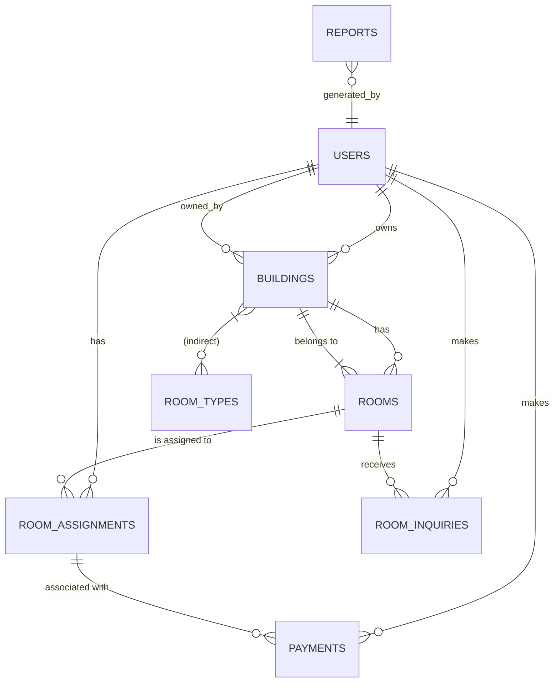

# ERD (Entity Relationship Diagram)

This diagram provides a high-level view of the relationships in the Dormitory Management System (Accommo).

Notes:
- `BUILDINGS.owner_id` references `USERS.user_id` (Landlord)
- `ROOM_ASSIGNMENTS.user_id` references `USERS.user_id` (Tenant)
- `PAYMENTS.user_id` references `USERS.user_id` (Tenant)
- `PAYMENTS.recorded_by` references `USERS.user_id` (Admin)
- `REPORTS.generated_by` references `USERS.user_id` (Admin)
- `ROOM_INQUIRIES` ties students to rooms and optionally assigns landlord (owner of the building)

Use this as a quick ERD for the project. For a production diagram, use a graphical ERD tool.